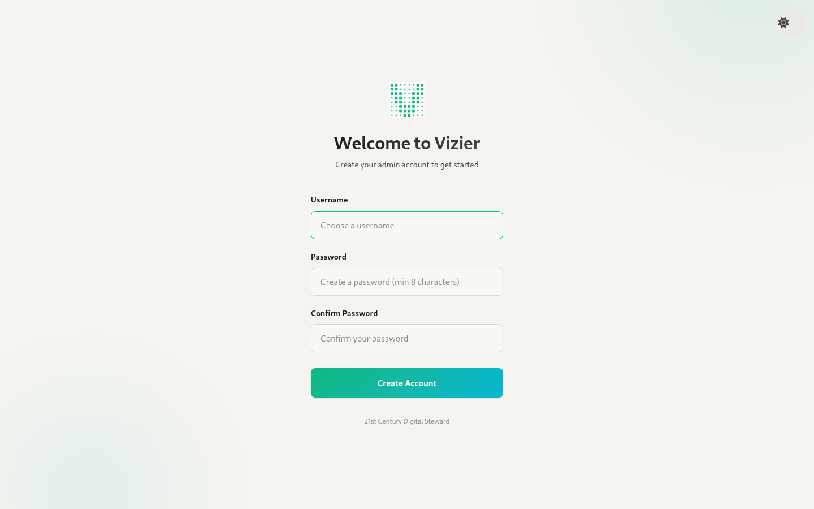
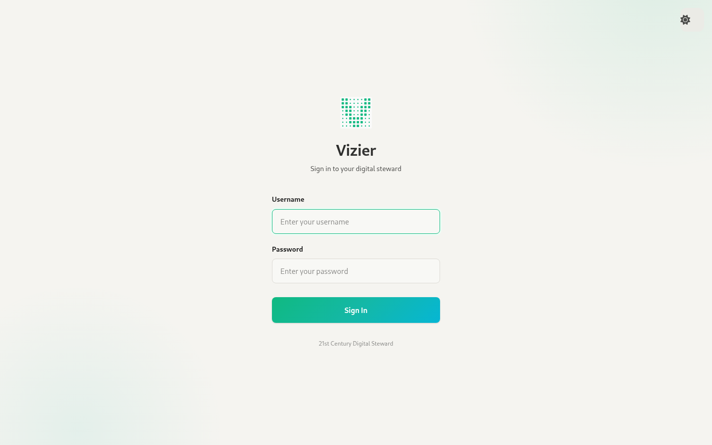

# 1. Onboarding & Login

Source: `webui/app/routes/onboarding.tsx`, `webui/app/routes/login.tsx`

## Onboarding — `/onboarding`

Shown only while the instance has no users (`GET /auth/setup-status → needs_setup`). Once setup is done the page redirects to `/login`.

- Fields: **Username**, **Password** (minimum 8 characters, checked client-side), **Confirm Password** (must match).
- **Create Account** calls `POST /auth/setup`, which creates the first user as **superadmin**, stores the returned JWT and goes to `/`.
- Errors show in an inline red banner and as a toast.
- There's a theme toggle in the top-right corner.

## Login — `/login`

- Already holding a token: you're redirected to `/`. Setup still needed: you're redirected to `/onboarding`.
- Fields: **Username** and **Password**. **Sign In** calls `POST /auth/login` and stores the JWT in `localStorage.auth_token`.
- Errors show in an inline banner and as a toast, and there's a theme toggle.
- There's no "forgot password", SSO, or remember-me. Sessions last as long as the JWT (about 30 days).
- Logging out (sidebar) only deletes the token on the client.
