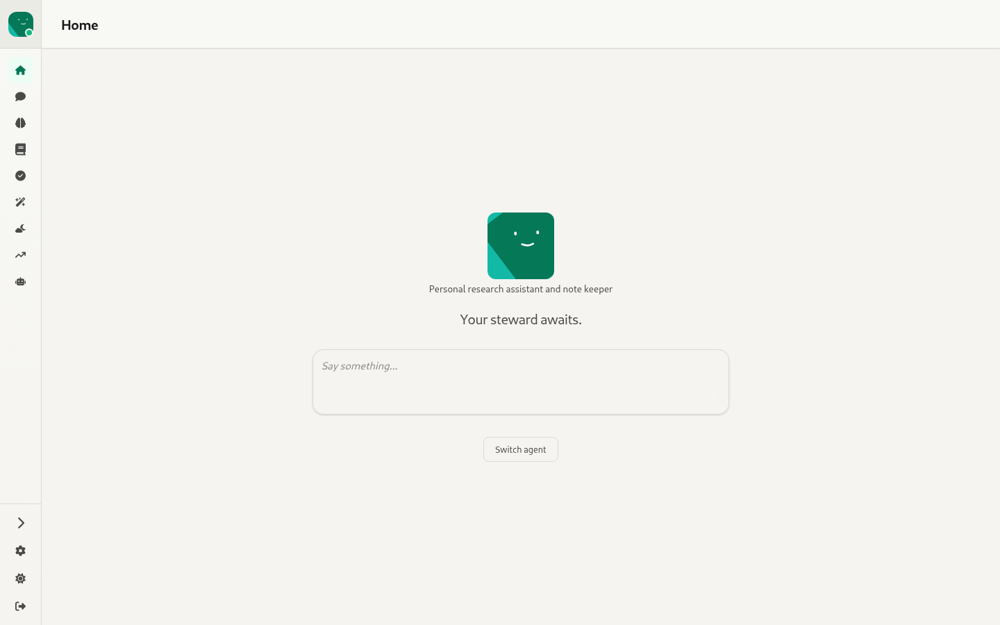
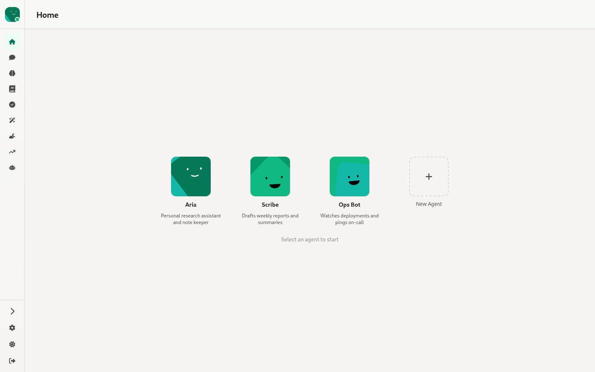
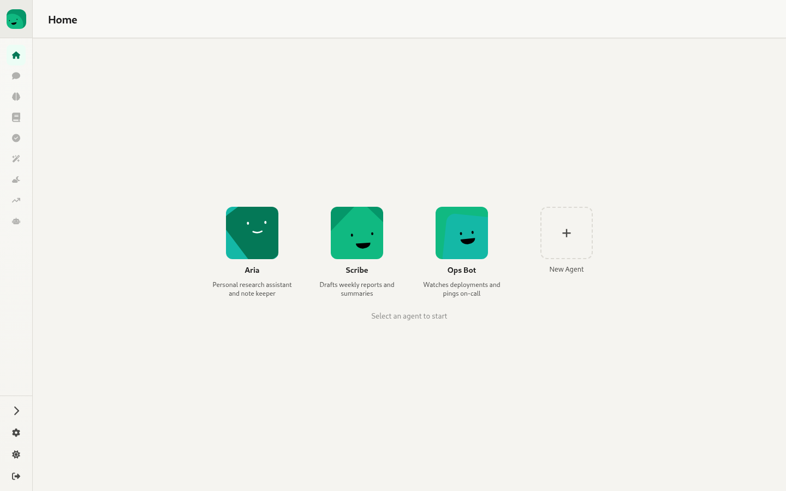

# 2. Home — `/`

Source: `webui/app/routes/home.tsx`

The home page has three states.

## a) Quick chat (when a "last agent" is remembered)

- Shows the agent's avatar and description, plus a random greeting ("Your steward awaits.", …).
- A Markdown composer (MDXEditor with the toolbar hidden). **Ctrl/⌘+Enter** or the send button creates a **new topic** named `chat-<timestamp>-<rand>`, navigates to `/:agent/chat/<topic>`, and the chat page sends the message on arrival (handed over through `quickChatStore`).
- **Switch agent** opens state (b).

## b) Agent picker

- A grid of every agent the user can see: avatar, name, and a two-line description.
- Clicking an agent makes it the current agent and returns to quick chat.
- The **+ New Agent** tile goes to `/agents/new`.
- Until an agent is picked, the per-agent sidebar items are disabled (greyed out in the second screenshot).

## c) Empty state

With no agents at all, the page shows the logo, "No agents yet. Create your first agent to get started." and the **New Agent** tile. There's a skeleton placeholder while agents load.
