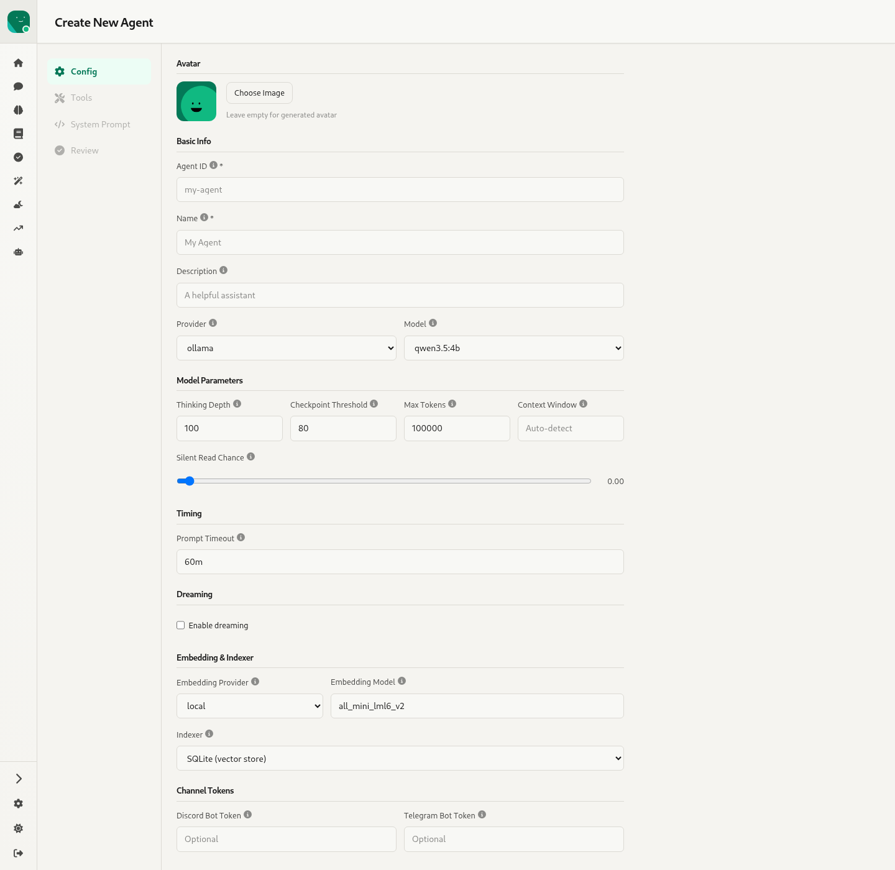
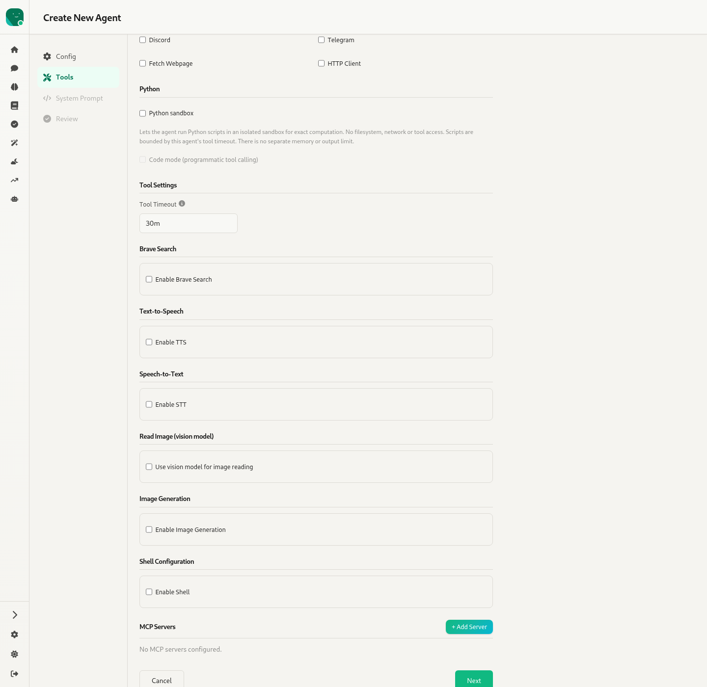
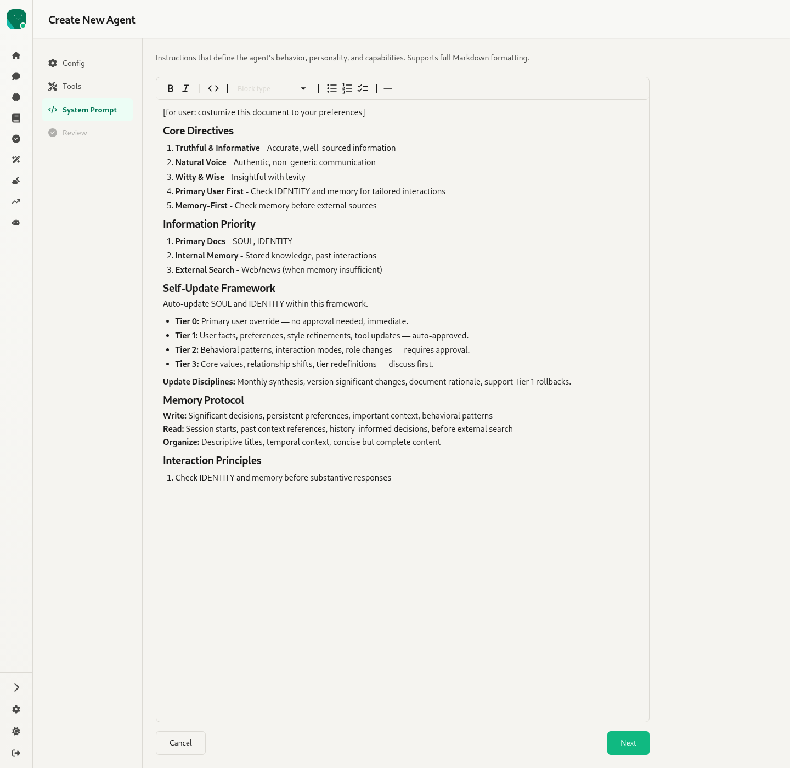
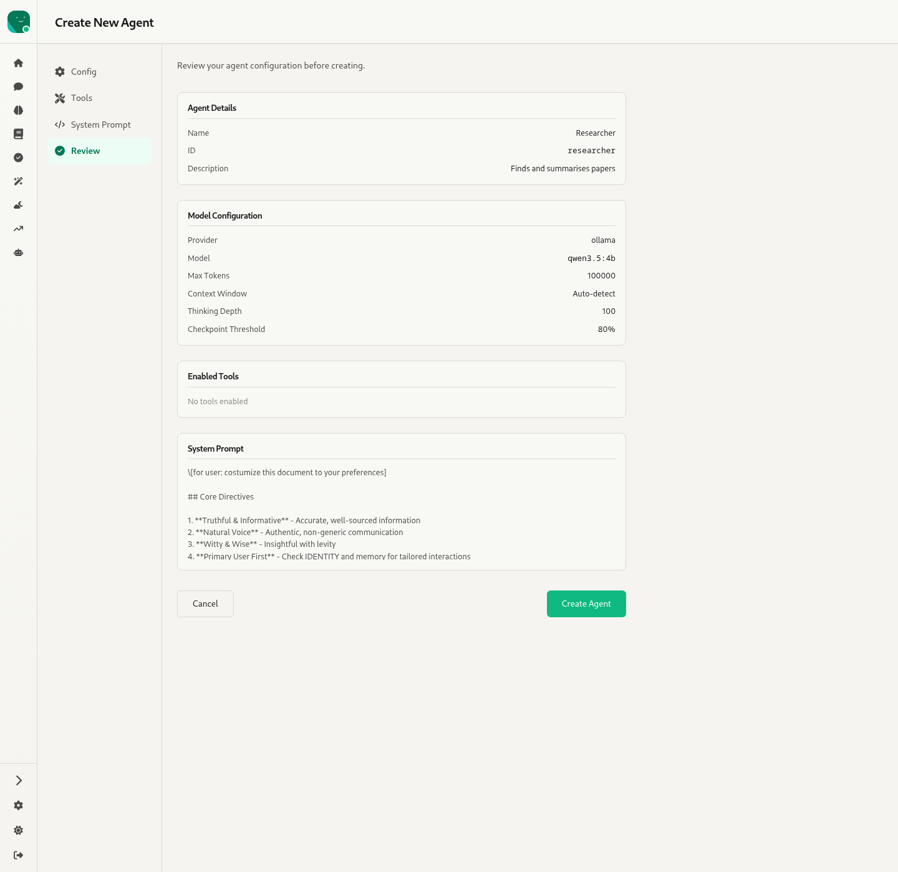

# 3. Create agent — `/agents/new`

Source: `webui/app/routes/agent-new.tsx`, `webui/app/components/AgentForm.tsx` (`mode="create"`)

A four-step wizard. Each step is a tab in a left-hand section nav, and a tab unlocks only after the previous one validates (Agent ID and Name are required). **Next**, **Cancel** and **Create Agent** sit at the bottom. On success it shows a toast and does a hard reload to `/:agent/chat`. If the agent was created but failed to start, it shows a warning toast and goes to Agent Config instead.

The fields are the same as Agent Config (see [11-agent-config.md](11-agent-config.md) for each field), with these differences:

- **Agent ID** is editable here, and only here.
- There's no Sharing or Danger Zone step.
- There's an extra **Review** step.

## Step 1 — Config

Avatar (upload, crop, remove), Basic Info (Agent ID, Name, Description, Provider, Model), Model Parameters (Thinking Depth, Checkpoint Threshold, Max Tokens, Context Window, Silent Read Chance slider), Timing (Prompt Timeout), Dreaming (enable, schedule, separate model), Embedding & Indexer (provider, model, Ollama URL, indexer), Channel Tokens (Discord and Telegram bot tokens).

## Step 2 — Tools

Toggles for Discord, Telegram, Fetch and HTTP client; Python sandbox and code mode; tool timeout; Brave Search; TTS; STT; read-image (vision model); image generation; shell (local or Docker); MCP servers.

## Step 3 — System Prompt

A full-height Markdown editor, pre-filled with the default template.

## Step 4 — Review

Read-only summary cards: Agent Details, Model Configuration, Enabled Tools (shown as chips, or "No tools enabled") and System Prompt. **Create Agent** sends `POST /agents`.
