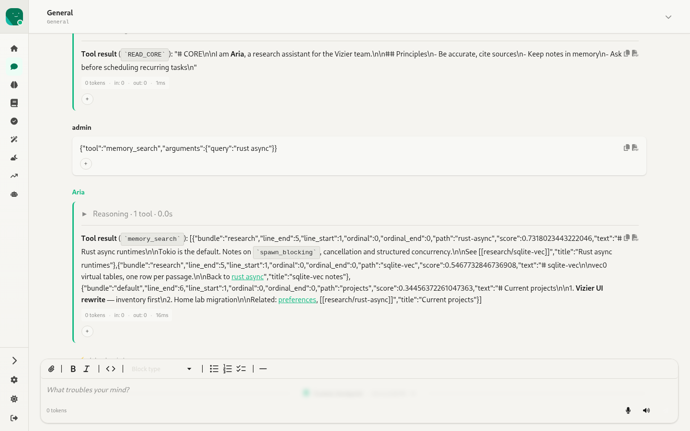
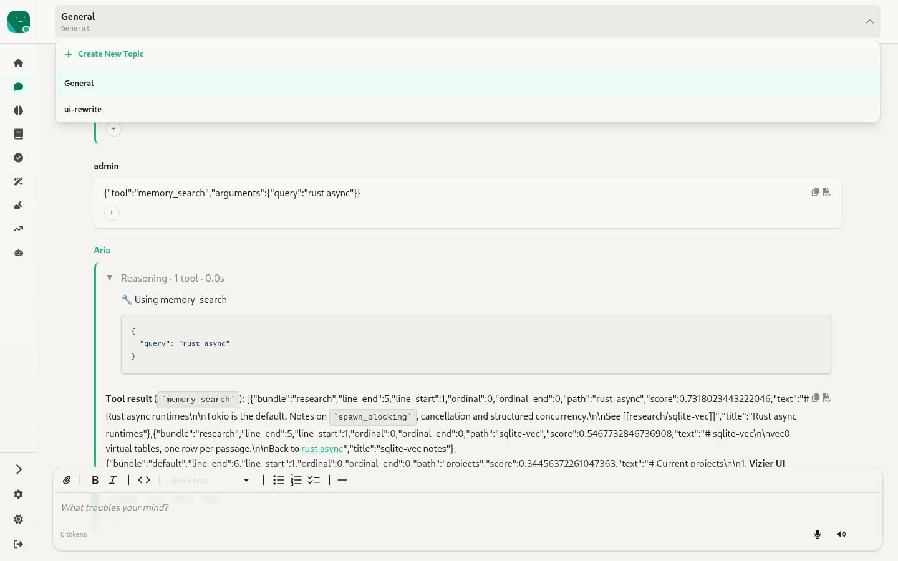
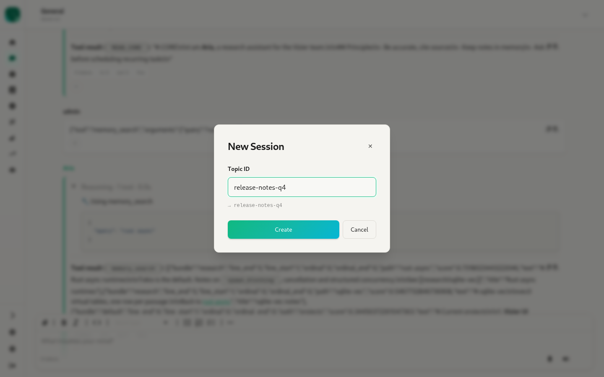
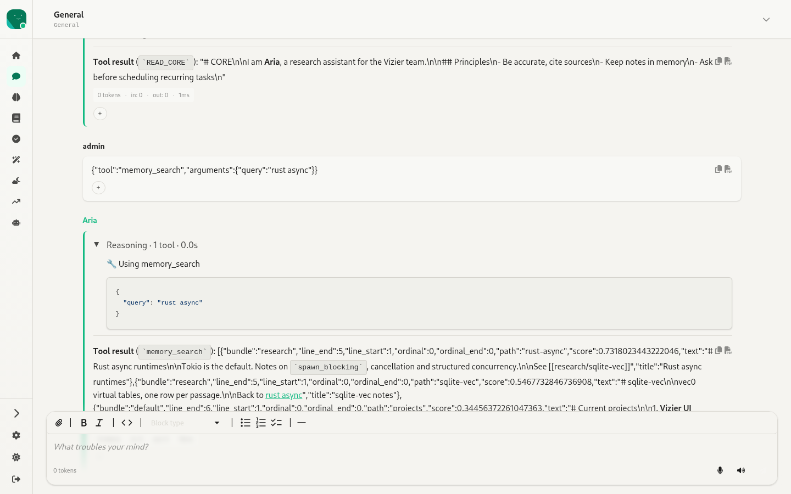
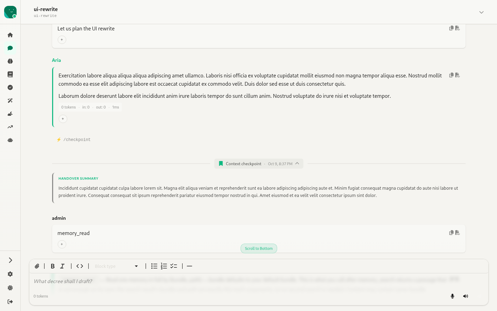
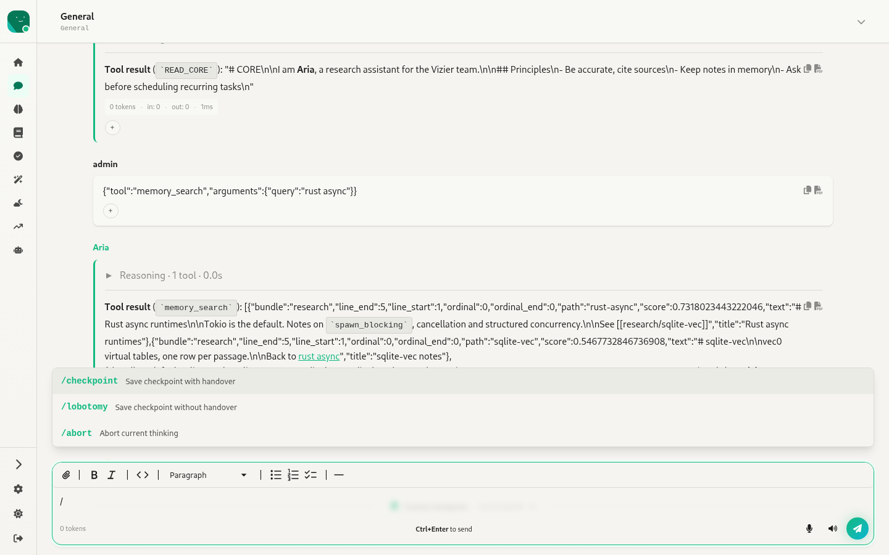

# 4. Chat — `/:agentId/chat/:topicId`

Source: `webui/app/routes/chat.tsx` (2.1k lines), `components/MessageItem.tsx`, `ActivityTrail.tsx`, `ThinkingIndicator.tsx`, `CheckpointDivider.tsx`, `AttachmentPreviewModal.tsx`, `EmojiPickerPopup.tsx`, `ReactionBadges.tsx`, `VoiceMessagePlayer.tsx`, `lib/trail.ts`

The main conversation surface. A **topic** is a WebUI session (channel `vizier-webui`). `/:agentId/chat` with no topic redirects to the last topic used for that agent, or to `General` if there isn't one.

## Header: topic selector

- Shows the topic title (when the backend has generated one) with the topic ID under it.
- The dropdown has **Create New Topic** and every topic for this agent, each with a 🗑 delete button (`confirm()` first).
- The new-topic modal auto-corrects the name into a slug and shows a live preview (`Release Notes Q4 → release-notes-q4`). Duplicate names are rejected with a toast.

## Message list

- **User messages** show the sender's username and a bubble.
- **Agent messages** show the agent name in the accent colour, with the bubble set off by a left accent border.
- On each message:
  - **Copy** to the clipboard and **Export as PDF** (`utils/exportPdf.ts`), as icons at the top right.
  - **Stats chip**: total tokens, in, out, response time. The tooltip adds input, output and cached counts.
  - **Reactions**: a `+` button opens an emoji picker, and the reaction badges toggle the user's own reaction. Reactions are sent over the WebSocket.
  - **Attachments** appear as chips, with thumbnails for images. Clicking one opens a preview modal for images, video, audio or documents.
  - **Voice messages** have an inline player. The agent's TTS **audio replies** also get a player.
  - **Error responses** are styled as errors.
- **Activity trail** ("Reasoning · 1 tool · 0.0s"): a collapsible `
` above each answer. It holds the agent's thoughts (as quotes), any narration, tool calls with human-readable labels from `formatToolChoice` (about 60 tools mapped to emoji labels), and Python sandbox execution reports. It stays open while the turn streams and folds once the turn is done. Turns loaded from history render the same way.

- **Thinking indicator**: while the agent works it shows a balloon with a random verb ("consulting the grand vizier…"), the live trail, and a **Stop** button that sends `abort`.
- **Queued messages**: messages sent while the agent is busy are shown with a ⏳ "queued" badge and released one at a time.
- **Command entries**: commands like `/checkpoint` appear in the history as ⚡ lines.
- **Checkpoint divider**: "Context checkpoint · time". Clicking it expands the **Handover Summary**.

- There's a **Scroll to bottom** pill when you're more than 200px from the bottom, and the list auto-scrolls when you're already near the bottom.
- Empty topics show "💬 No messages yet. Start the conversation!"

## Composer

- An MDXEditor with a toolbar (attach, bold, italic, code, block type, lists, horizontal rule) and a random placeholder ("What troubles your mind?"). While the WebSocket is down the placeholder reads "Connecting...".
- **Ctrl/⌘+Enter** sends, and a hint appears once you've typed something.
- **Slash commands** come with an autocomplete popup (arrow keys and Enter):
  - `/checkpoint`: save a checkpoint with handover
  - `/lobotomy`: save a checkpoint without handover
  - `/abort`: abort the current thinking

- **Attachments** can be added with the paperclip, by dragging files in (a drop overlay appears; images, video, audio, pdf, doc, docx and txt are accepted), or by pasting an image. Pending attachments show as chips with thumbnails, a remove button and **Clear all**. They're uploaded through `POST /files/upload` when the message is sent.
- **Voice messages**: the mic button records with MediaRecorder and shows a timer. You then send or discard the recording. It's converted to WAV and sent as `audio_chat`.
- **Audio reply toggle** (🔊): asks the agent to reply with TTS (`expect_audio_reply`).
- **Context meter**: "14K/128K (11%)", taken from the last response's stats.

## Transport

- WebSocket at `/api/v1/agents/:id/channel/vizier-webui/topic/:topic/chat?token=…`. Incoming events are `thinking`, `tool_choice`, `tool_response`, `message`, `error`, `audio_reply`, `checkpoint`, `empty` and `abort`.
- `GET …/topic/:topic/detail` is polled every second for `is_thinking`.
- History is loaded once with `GET …/topic/:topic/history` and isn't fetched again.
