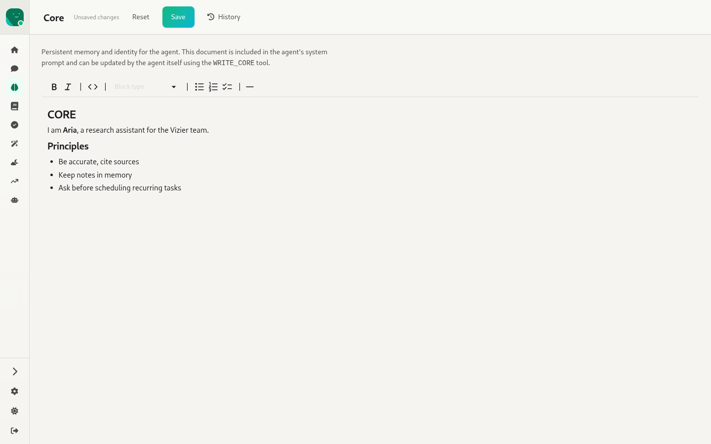
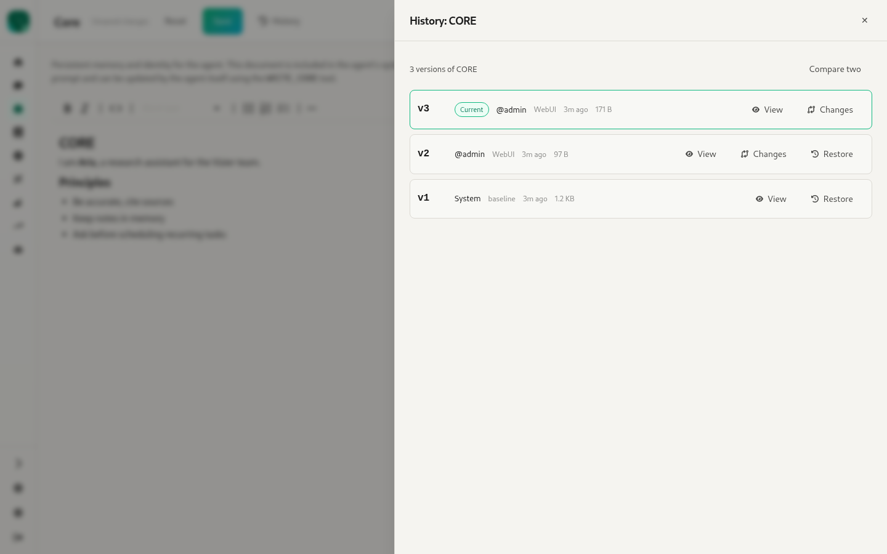

# 5. Core — `/:agentId/core`

Source: `webui/app/routes/agent-core.tsx`, `components/VersionHistory.tsx`, `components/SlideOver.tsx`

The agent's persistent identity document, **CORE.md**. It's injected into the system prompt, and the agent can rewrite it itself with the `WRITE_CORE` tool.

- A full-height MDXEditor with a toolbar, plus a short explanation of what CORE is.
- When there are edits, the header shows "Unsaved changes" with **Reset** and **Save** (`PUT /agents/:id/core`).
  - ⚠ The indicator appears as soon as the page opens, because the editor normalises the markdown.
- **History** opens the shared version-history slide-over:

- **Version history panel** (shared with memory):
  - Shows "N versions of X". Each row has a version number, a "Current" badge, the author (`@user`, `System`), the origin (WebUI, tool, baseline…), a relative time and the size.
  - Each row has **View** (rendered content), **Changes** (a line diff against the previous version) and **Restore**, which saves the old content as a new version after a confirm step and warns that unsaved edits will be lost.
  - **Compare two**: pick two rows to see the diff between them.
