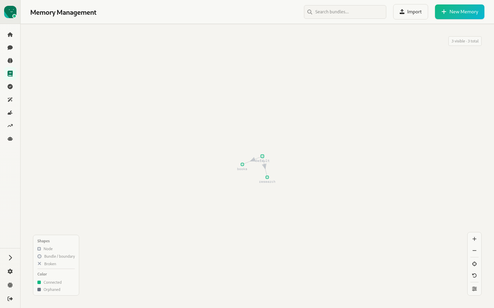
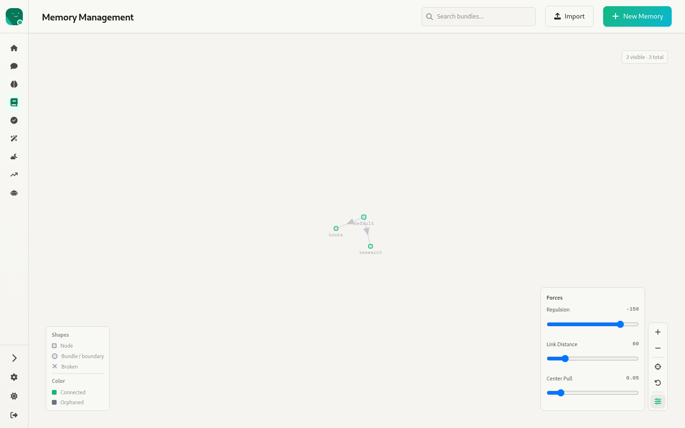
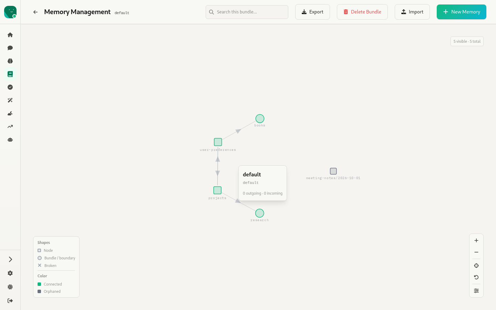
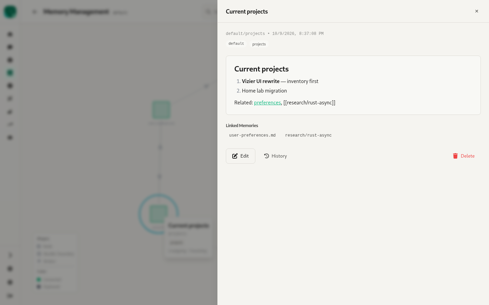
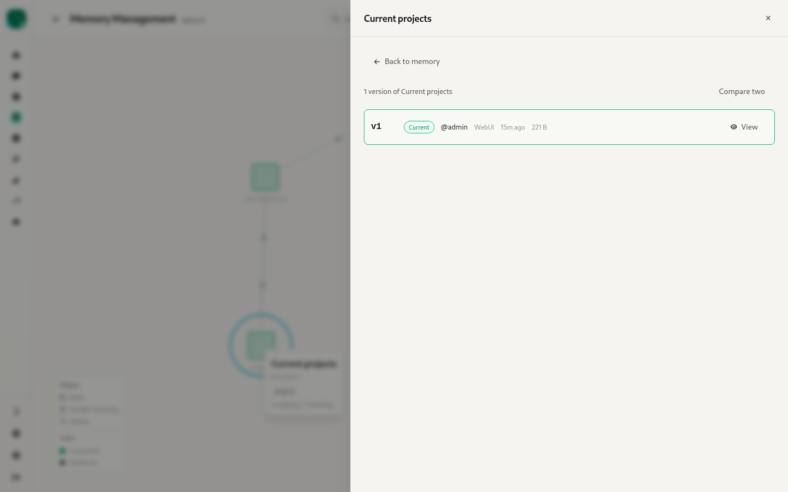
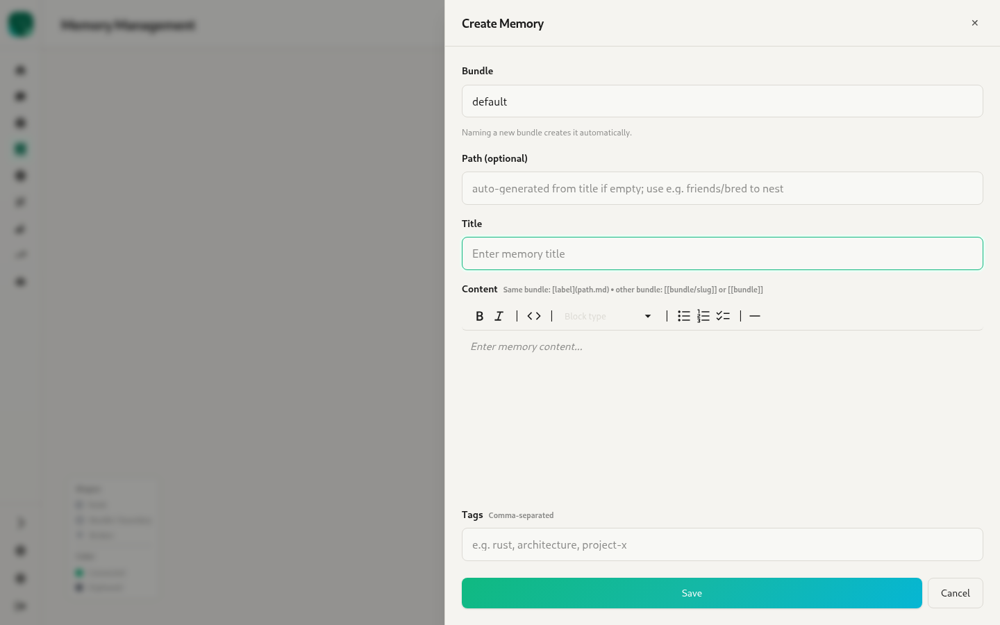
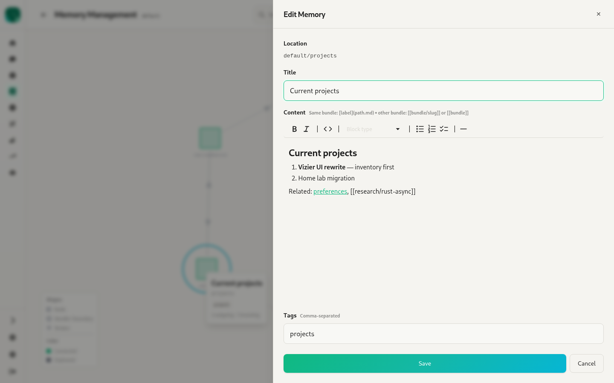
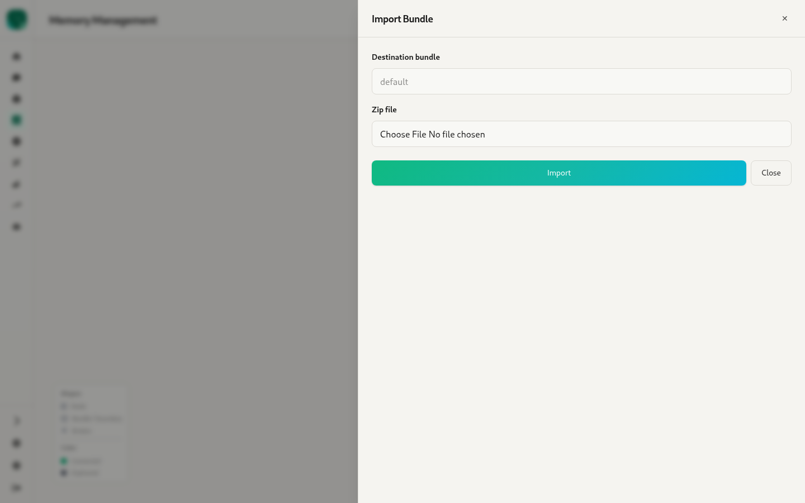

# 6. Memory — `/:agentId/memory`

Source: `webui/app/routes/memory.tsx` (1k lines), `components/MemoryGraph.tsx` (canvas force graph, 800 lines), `VersionHistory.tsx`, `AttachmentChip.tsx`, `hooks/useFileAttachments.ts`

Agent memory is markdown **concepts** grouped into **bundles** (see `specs/004-memory-open-format`). The whole page is a **graph browser**. There's no list or table view.

## Top level: bundles graph

- Each node is a **bundle**, and the edges are links between bundles.
- The header has a search box ("Search bundles…", kept in the URL as `?search=`), **Import** and **+ New Memory**.
- Graph controls:
  - A "N visible · N total" counter.
  - A legend. Shapes: node, bundle/boundary, broken. Colours: connected, orphaned.
  - Zoom in and out, reset view, reset to the initial set, and **force controls** (sliders for repulsion, link distance and centre pull).
  - You can drag nodes, pan, zoom with the scroll wheel, and hover a node for a tooltip with its title and tags.
- Clicking a node opens a **node card** (title, path, "N outgoing · N incoming") with **Open** and **Delete**.

- If the agent has no embedding model configured, a banner says semantic search and the graph are unavailable and links to **Configure embedding**.

## Inside a bundle: concepts graph

- The header gains a ← back button, a bundle badge, **Export** (downloads `<bundle>.zip`) and **Delete Bundle**.
  - Delete Bundle force-deletes when the bundle still has concepts, after a `confirm()`.
- Nodes are concepts. **Boundary** nodes stand for links into other bundles, and clicking one jumps to that bundle.

## View memory (slide-over)

- Shows `bundle/path • updated time`, a bundle badge and tag chips.
- The rendered markdown body handles both kinds of link:
  - Same-bundle links (`[label](path.md)`) open that memory inside the slide-over.
  - Cross-bundle wikilinks (`[[bundle/slug]]`) are resolved too.
- **Attachments** (chips that open a preview) and **Linked Memories** (relation chips you can navigate).
- Actions: **Edit**, **History**, **Delete**.

History uses the same panel as Core. It covers deleted versions too, so a memory can be restored after it was deleted.

## Create / edit memory (slide-over)

- **Create** asks for a **Bundle** (defaults to `default`, or the bundle you're in; naming a new bundle creates it), an optional **Path** (auto-slugged, `/` allowed to nest), **Title**, **Content** and **Tags** (comma-separated).
  - A hint under Content shows the link syntax: `[label](path.md)` within a bundle, `[[bundle/slug]]` or `[[bundle]]` across bundles.
- **Edit** shows the location read-only. Title, content, tags and attachments can be changed.
- Attachments: existing ones plus new ones, added by file picker, drag and drop or paste.

## Import bundle (slide-over)

Destination bundle and a zip file. After the upload it shows a report: how many memories were imported, and which were skipped because they already existed.
