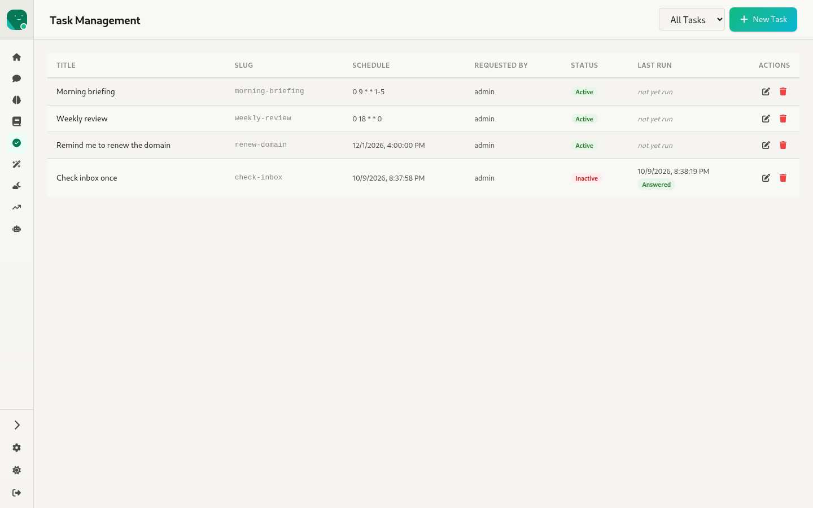
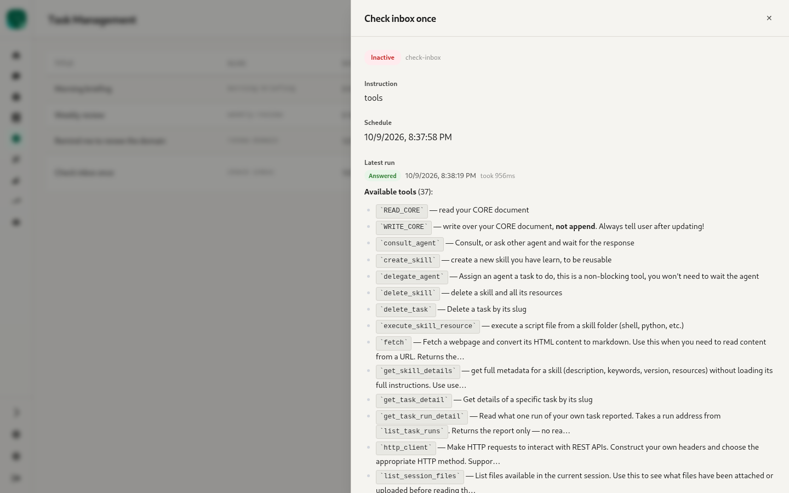
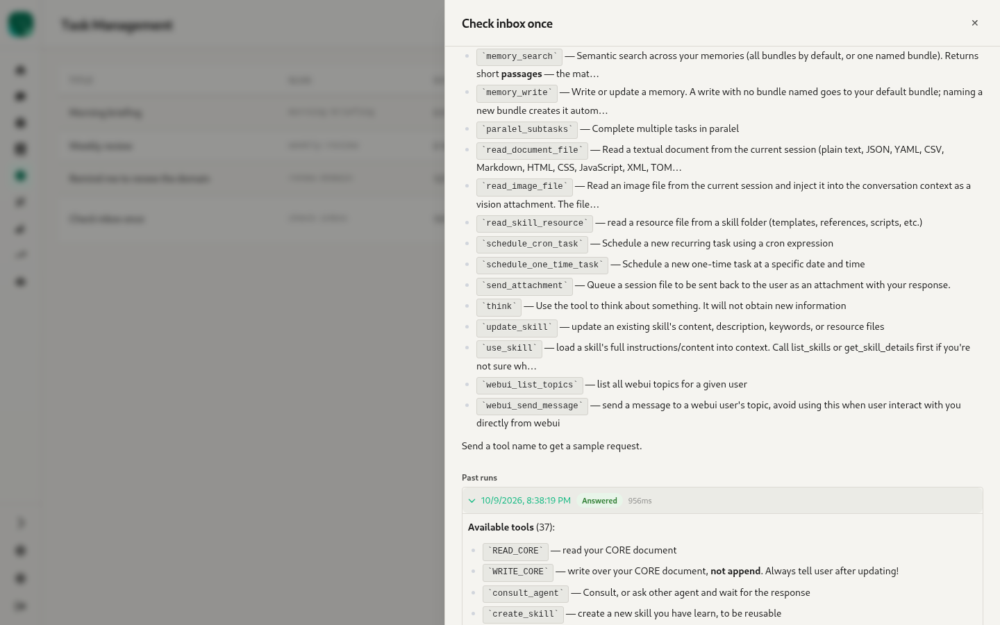
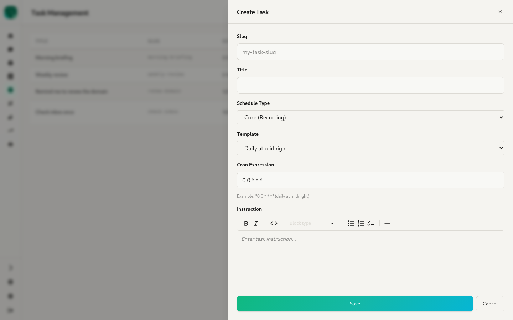

# 7. Tasks — `/:agentId/tasks`

Source: `webui/app/routes/tasks.tsx`, `components/DatePicker.tsx`, `ActivityTrail.tsx` (see `specs/011-task-completion-reports`)

Scheduled instructions the agent runs on its own: either **cron** (recurring) or **one-time**.

- A filter dropdown (**All Tasks / Active / Inactive**) and **+ New Task**.
- Table columns: **Title, Slug, Schedule, Requested by, Status** (Active/Inactive), **Last run** (time plus a state badge: Answered, No response, Interrupted or Running; otherwise "not yet run"), and **Actions** (edit, delete).
- A one-time task that has fired turns **Inactive** rather than being deleted.

## Task detail (slide-over)

- Shows the status badge and slug, the **Instruction** (rendered), the **Schedule**, and the **Latest run** (state, time, duration, then the rendered report).
  - Placeholder texts cover the cases with no report: still running, interrupted, or no report produced.
- **Past runs**: paged 10 at a time with key-set paging. Expanding a run shows its report and the **activity trail** of that run's session, loaded from `…/runs/:run_id/history`.
- **Edit** and **Delete** buttons.

## Create / edit task (slide-over)

- **Slug**: auto-slugged, and locked when editing.
- **Title**.
- **Schedule Type**: Cron (Recurring) or One-Time.
  - **Cron** has a **Template** dropdown (every 15 minutes, hourly, daily at midnight or noon, weekly, weekdays at 9am, monthly, quarterly, yearly, or custom) and a free-text **Cron Expression**.
  - **One-Time** uses a custom **DatePicker** (date and time in UTC).
- **Instruction**: a Markdown editor.
- The requester is taken from the logged-in user. It isn't a form field.
