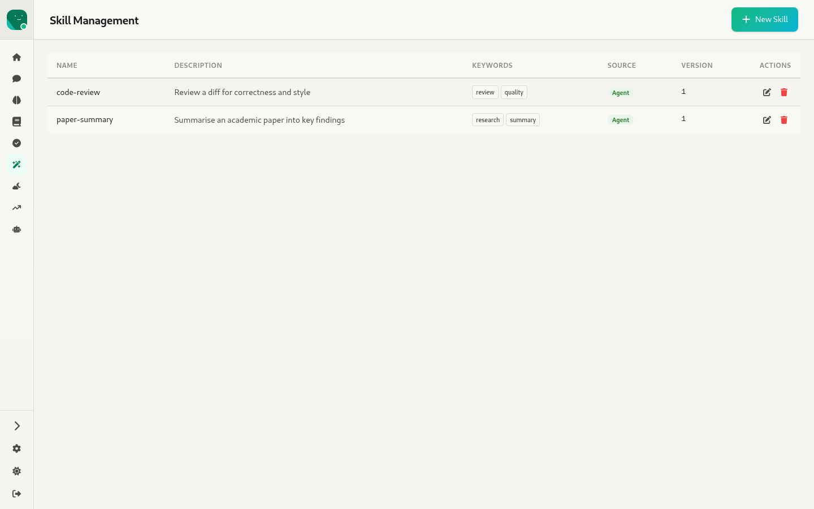
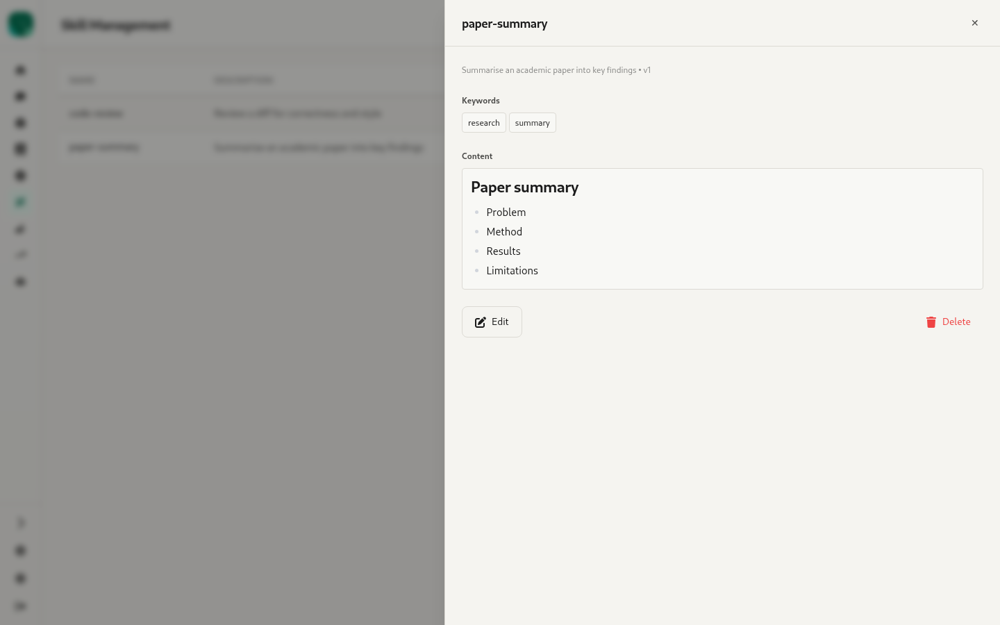
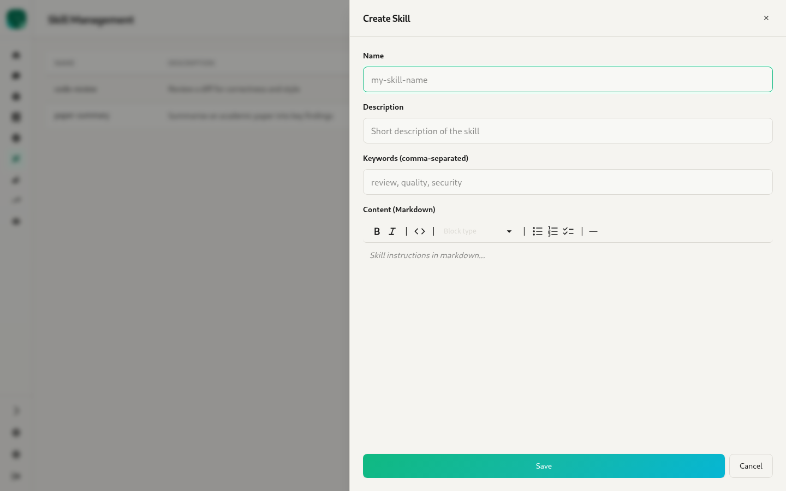

# 8. Skills — `/:agentId/skills`

Source: `webui/app/routes/skills.tsx`

Reusable instruction packs the agent can load with `use_skill`. The page manages the skills attached to *this agent*: `/agents/:id/skills`.

- Table columns: **Name, Description, Keywords** (chips), **Source** (e.g. Agent), **Version**, and **Actions** (edit, delete).
- The empty state reads "No skills yet / Create your first skill to get started".

- The detail slide-over shows the description and version, keyword chips, the rendered **Content**, and **Resources** (the files bundled with the skill, if any), plus **Edit** and **Delete**.

- The create/edit form has **Name** (create only), **Description**, **Keywords** (comma-separated) and **Content** (Markdown).
- Skill *packages* installed through `vizier skill install` (the global `/skills` registry) have no management UI of their own.
