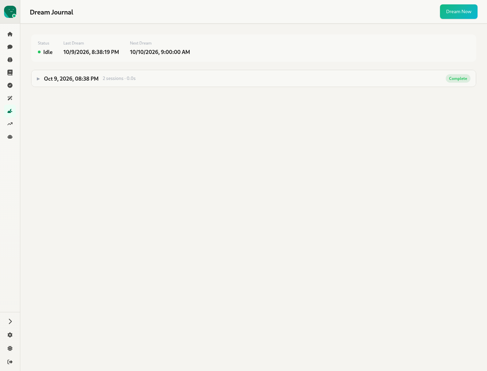
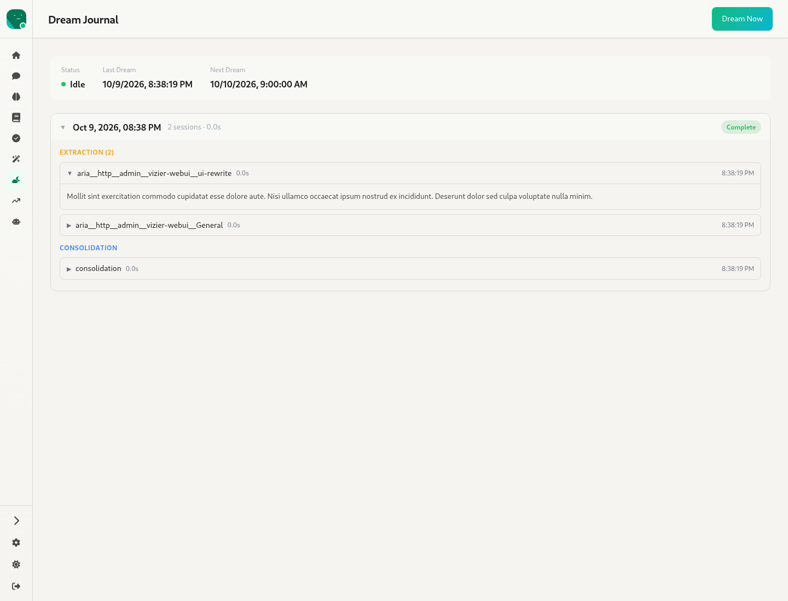

# 9. Dreams — `/:agentId/dream`

Source: `webui/app/routes/agent-dream.tsx`

The **dream cycle** is a periodic, unattended reflection pass. It extracts insights from recent sessions and then consolidates them into memory.

- The status bar shows:
  - **Status**: Idle, Extracting (n/N sessions) or Consolidating, with a coloured dot.
  - **Last Dream** and **Next Dream**.
  - **Model**: provider/model, when a separate dream model is configured.
- **Dream Now** (`POST /dream/trigger`) is disabled while a dream is running.
- **Timeline**: one collapsible row per cycle. Each row shows the date, the number of sessions, the total duration and a Complete / In Progress badge.

- An expanded cycle lists **Extraction (n)** entries (one per session, labelled by session context) and a **Consolidation** entry. Each entry expands to its journal text, with its duration and time.
- The empty state explains how to enable dreaming.
- The colours here are hard-coded hex values (`#9ca3af`, `#22c55e`…) rather than theme tokens.
