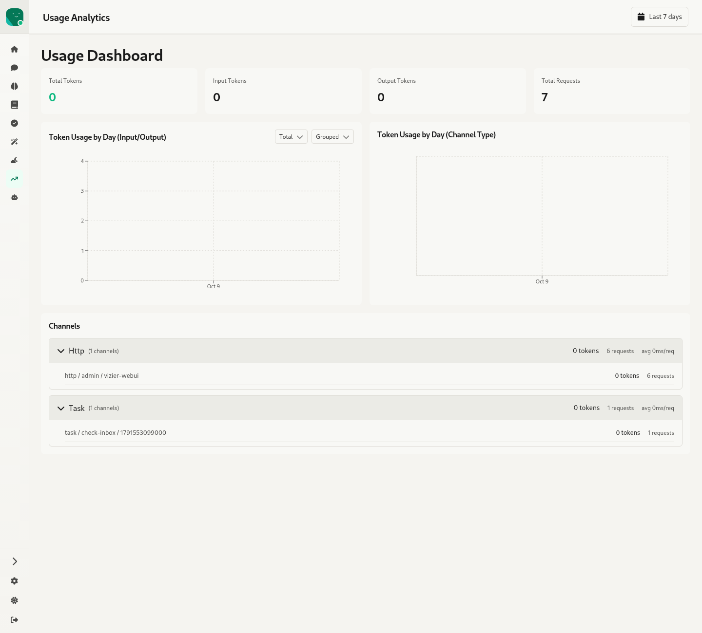

# 10. Usage — `/:agentId/usage`

Source: `webui/app/routes/usage.tsx`, `components/UsageBarChart.tsx` (Recharts), `CustomSelect.tsx`

*(The demo agent runs on `dummyplug`, so every token count is 0.)*

- A **date range** popover in the header:
  - Quick picks: last 7, 14, 30 or 90 days.
  - A custom start and end date, with a button to clear them.
- **Summary tiles**: Total Tokens, Input Tokens, Output Tokens, Total Requests.
- **Token Usage by Day (Input/Output)**: a bar chart with a metric selector (Total / Input / Output) and a display selector (Grouped / Stacked).
- **Token Usage by Day (Channel Type)**: a stacked bar chart by channel type (http, task, discord, telegram…).
- **Channels**: an expandable row per channel type (tokens, requests, average per request), which expands to the individual channels.
  - ⚠ The "avg …/req" value is tokens per request formatted as a duration.
- The page has two titles, "Usage Analytics" in the header and "Usage Dashboard" in the body.
- There's no cross-agent or instance-wide usage view; this page is per agent.
