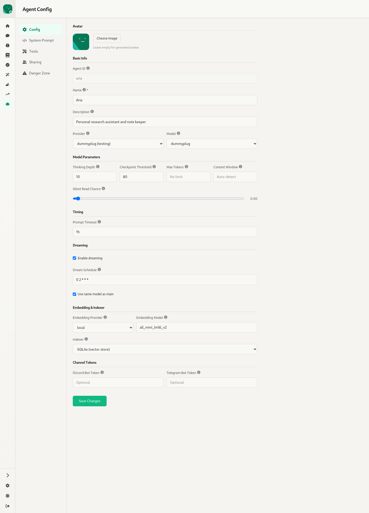
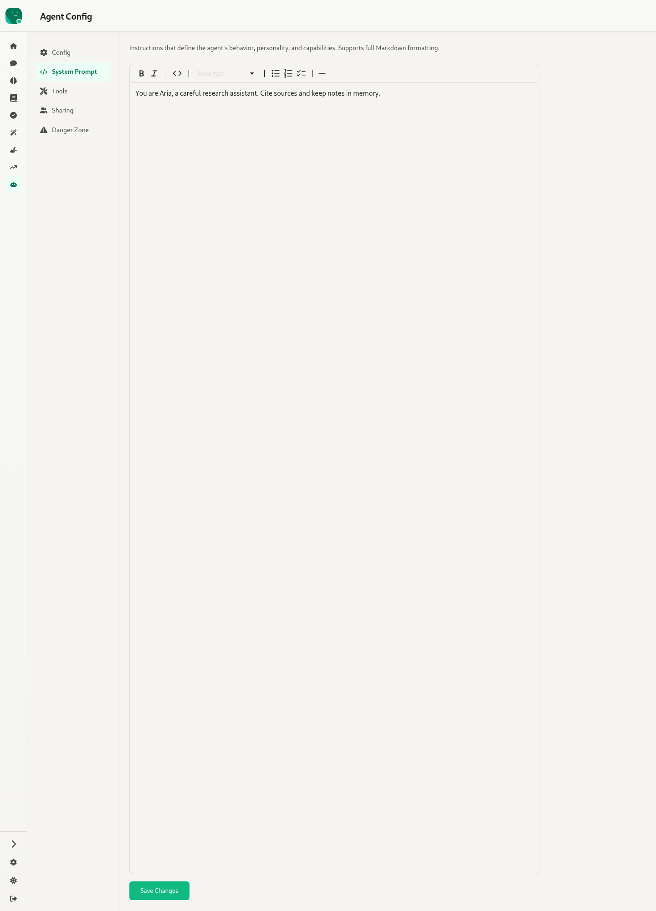
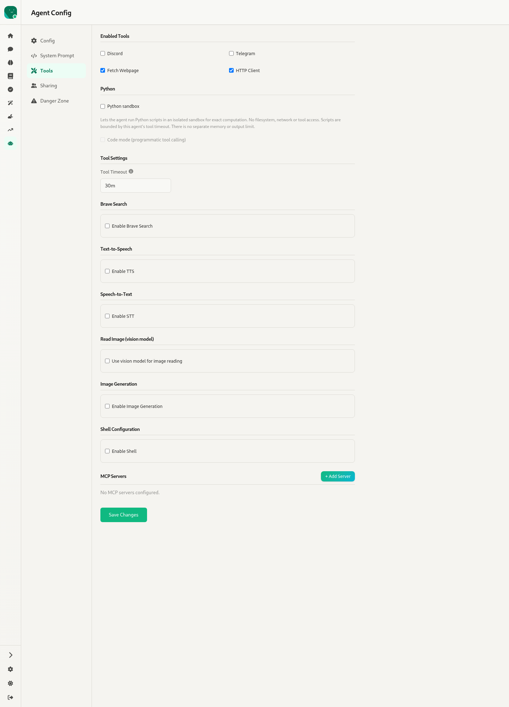
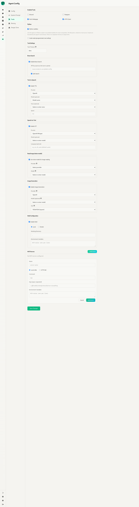
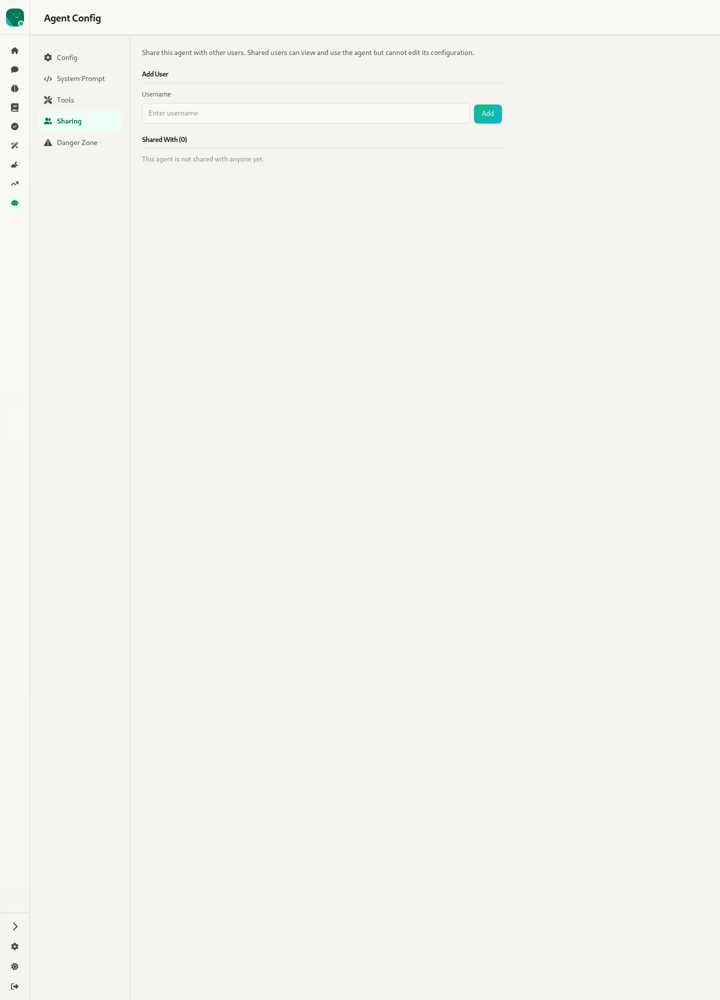
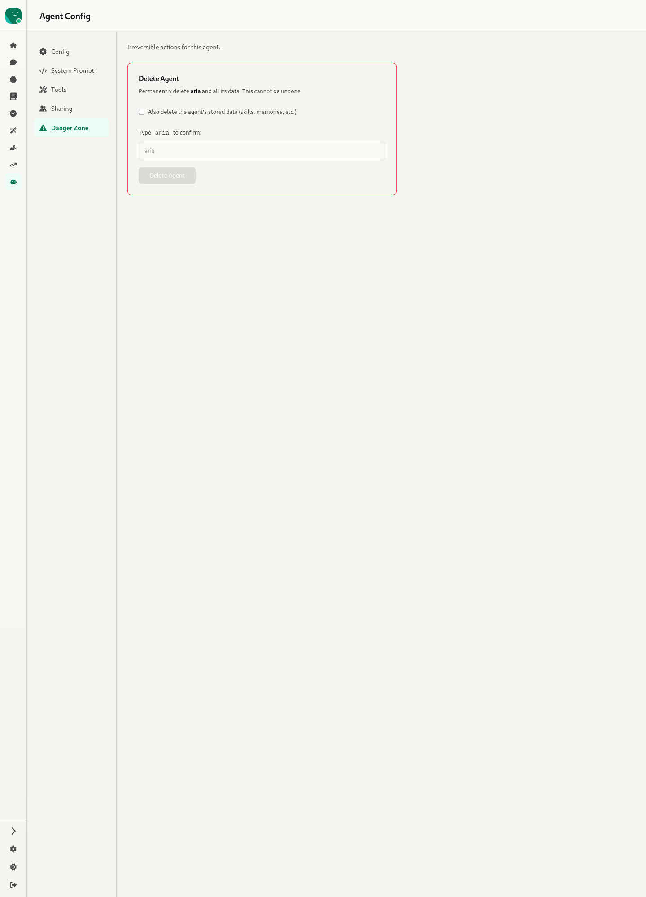

# 11. Agent Config — `/:agentId/settings`

Source: `webui/app/routes/agent-settings.tsx` (3.3k lines), `components/EmbeddingIndexerSection.tsx`, `PythonSandboxSection.tsx`, `ModelSelect.tsx`, `AvatarCropModal.tsx`, `TooltipLabel.tsx`

The edit counterpart of the create wizard ([03](03-create-agent.md)). It's re-implemented separately from `AgentForm.tsx` rather than reusing it. Only the agent's owner, or a user with `all_agents:edit`, can open it; for everyone else the sidebar item is disabled with a tooltip. Five sections sit in a left nav (horizontal tabs on mobile), and each section has its own **Save Changes** (`PUT /agents/:id`, which restarts the agent).

Every field has an ⓘ tooltip, written out below.

## Config

**Avatar**: Choose Image, crop it in a modal, or Remove (leave it empty for a generated avatar).

**Basic Info**
| Field | Notes |
|---|---|
| Agent ID | Read-only after creation. Lowercase letters, numbers, `-` and `_`. |
| Name * | Display name |
| Description | Optional |
| Provider | Dropdown of the configured providers |
| Model | Combobox (`ModelSelect`): pick from the provider's list or type a name |

**Model Parameters**
| Field | Notes |
|---|---|
| Thinking Depth | Maximum LLM turns per request; 0 means unlimited |
| Checkpoint Threshold | Percentage of the context window that triggers a checkpoint (default 80) |
| Max Tokens | Output tokens per completion. Placeholder "No limit" |
| Context Window | Tokens. Placeholder "Auto-detect" |
| Silent Read Chance | Slider from 0.0 to 1.0: how likely the agent is to read channel messages it wasn't addressed in |

**Timing**: Prompt Timeout (e.g. `60m`).

**Dreaming**: Enable dreaming → Dream Schedule (cron, default `0 2 * * *`), then "Use same model as main", or set a Dream Provider and Dream Model.

**Embedding & Indexer**:
- Embedding Provider: local, ollama, openai…
- Embedding Model: a dropdown of 29 models for `local`, free text for the others.
- Ollama Base URL override.
- Indexer: SQLite vector store.

**Channel Tokens**: Discord Bot Token and Telegram Bot Token.

## System Prompt

A full-height Markdown editor for the agent's instructions.

## Tools

With every section switched on (the tall capture):

| Section | Controls |
|---|---|
| Enabled Tools | Discord, Telegram, Fetch Webpage, HTTP Client |
| Python | Python sandbox, then **Code mode** (programmatic tool calling, which hides the other tools). Code mode requires the sandbox. |
| Tool Settings | Tool Timeout |
| Brave Search | Enable; API key (falls back to the global key); Safe Search |
| Text-to-Speech | Enable; Provider (OpenAI / OpenRouter / ElevenLabs…); Model; Voice; Speed |
| Speech-to-Text | Enable; Provider; Model; Language |
| Read Image (vision model) | Use a vision model; Provider; Model |
| Image Generation | Enable; Provider; Model; Size |
| Shell Configuration | Enable; **Local** (working directory, env vars) or **Docker** (Pull an image or build from a Dockerfile; image name, Dockerfile path, container name). |
| MCP Servers | List with Edit and Delete; **+ Add Server** takes a name and a type: *Local stdio* (command, args, env) or *HTTP SSE* (URI). |

## Sharing

Share the agent with other users by username. Shared users can view and use the agent but can't edit it. The "Shared With (n)" list has remove buttons.

## Danger Zone

**Delete Agent** is enabled only after you type the agent ID. An optional checkbox also deletes the agent's stored data (skills, memories…).

## Config fields that have no UI

- `chunking` (`ChunkLimits`: target, min and max sizes for memory passages).
- `auto_context` (`chat_passages`, `silent_read_passages`, `threshold`, `size_cap`, `per_document`): the automatic memory context injected into chats.
