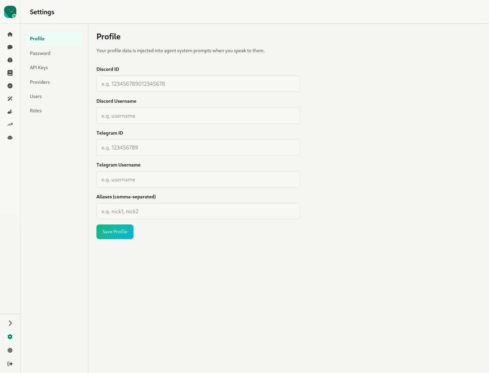
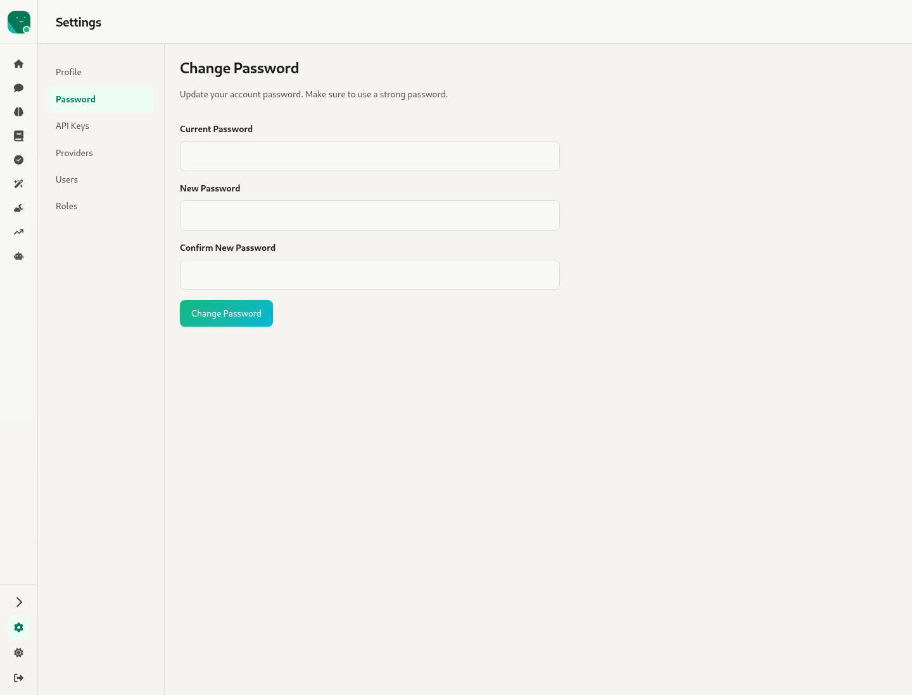
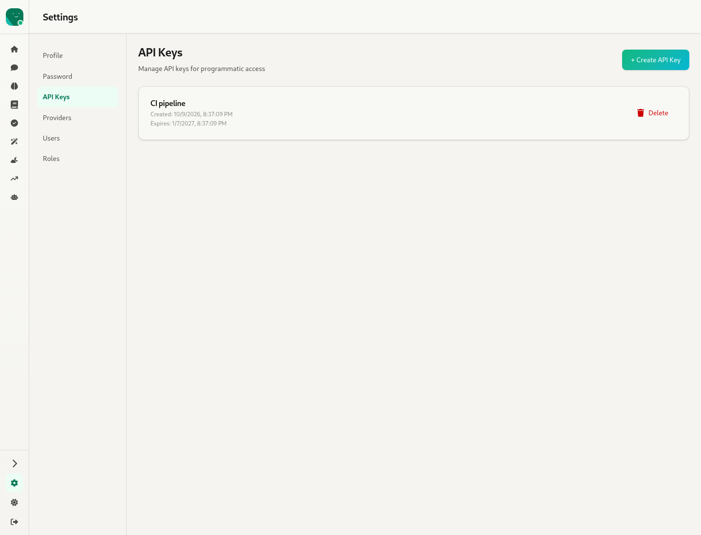
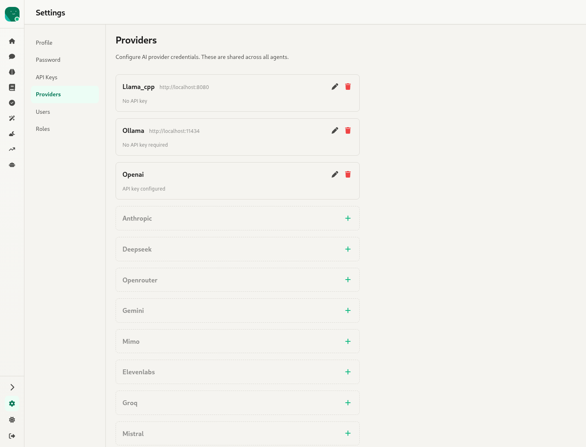
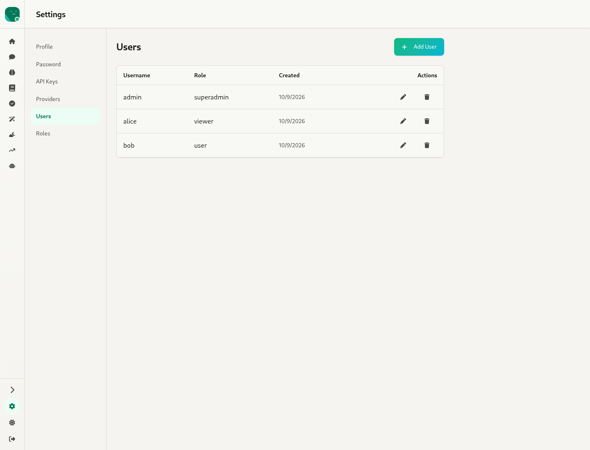
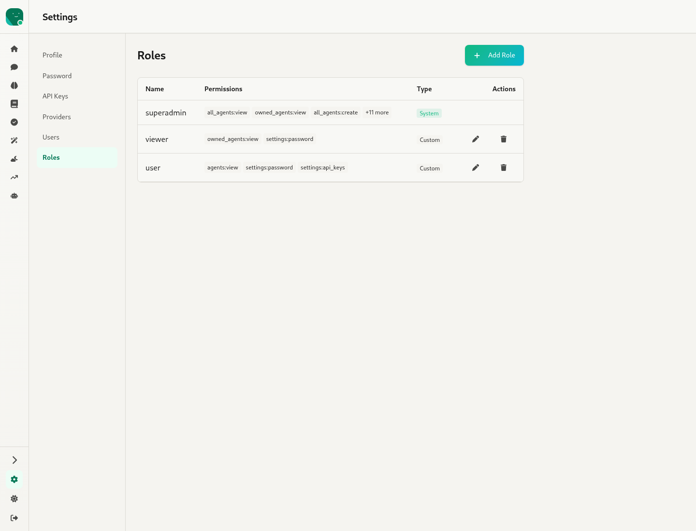

# 12. Global Settings — `/settings`

Source: `webui/app/routes/settingsRoot.tsx` (1.9k lines), `components/UsersSection.tsx`, `components/RolesSection.tsx`

A left nav of sections (horizontal tabs on mobile). Every section except Profile depends on a permission.

## Profile

"Your profile data is injected into agent system prompts when you speak to them." The fields are Discord ID, Discord Username, Telegram ID, Telegram Username and Aliases (comma-separated). Agents use them to recognise you across channels. **Save Profile**.

## Password  *(needs `settings:password`)*

Current Password, New Password, Confirm New Password.

## API Keys  *(needs `settings:api_keys`)*

- A list of keys showing name, created date, expiry and **Delete**.
- **+ Create API Key** asks for a Key Name and Expires In (days).
- The new key appears once, in an "API Key Created" modal with **Copy to Clipboard** and a warning that it won't be shown again.

## Providers  *(needs `settings:providers`)*

"Configure AI provider credentials. These are shared across all agents."

- Configured providers are at the top, each with a summary (base URL, or "API key configured") and edit and delete buttons.
- Below them, every unconfigured provider has a **+** to add it. The UI lists 29 provider variants: ollama, openai, anthropic, deepseek, openrouter, gemini, mimo, llama_cpp, elevenlabs, groq, mistral, xai, perplexity, moonshot, zai, minimax, together, cohere, huggingface, hyperbolic, voyageai, galadriel, mira, chatgpt, copilot, azure, custom, opencode_zen and opencode_go.
- The inline edit form changes with the provider:
  - Most providers: API key.
  - Azure: endpoint and key.
  - ChatGPT: access token and account ID.
  - ollama, llama_cpp and custom: base URL.

## Users  *(needs `users:manage`)*

- A table of users: Username, Role, Created, and Actions (edit role or password, delete).
- **+ Add User** takes a username, password and role.

## Roles  *(needs `roles:manage`)*

- A table of roles: Name, Permissions (chips), Type (**System**, e.g. `superadmin`, or **Custom**), and Actions.
- **+ Add Role** takes a role name and a checklist of permissions grouped by area.

| Permission | Label |
|---|---|
| `all_agents:view` | View All Agents |
| `owned_agents:view` | View Owned Agents |
| `all_agents:create` | Create Agents |
| `all_agents:edit` | Edit All Agents |
| `owned_agents:edit` | Edit Owned Agents |
| `all_agents:delete` | Delete All Agents |
| `owned_agents:delete` | Delete Owned Agents |
| `settings:providers` | Manage Providers |
| `agents:mcp_config` | Configure Agent MCP |
| `agents:shell_config` | Configure Agent Shell |
| `settings:password` | Change Password |
| `settings:api_keys` | Manage API Keys |
| `users:manage` | Manage Users |
| `roles:manage` | Manage Roles |

⚠ `agents:mcp_config` and `agents:shell_config` can be granted, but nothing checks them, neither the UI nor the backend (`src/storage/user.rs` only declares them). The MCP and Shell sections of Agent Config are open to anyone who can edit the agent.
