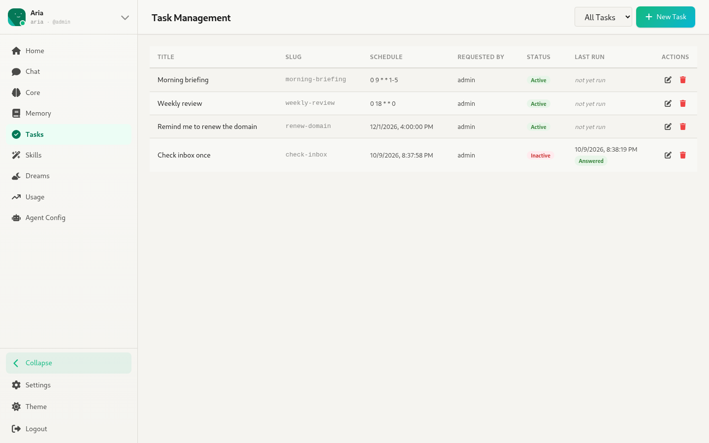
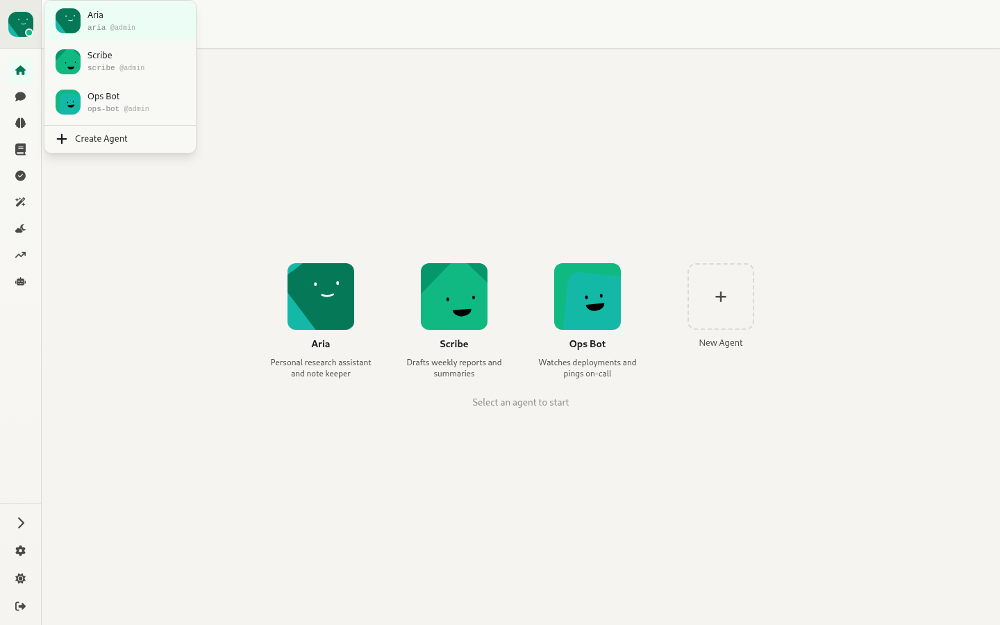
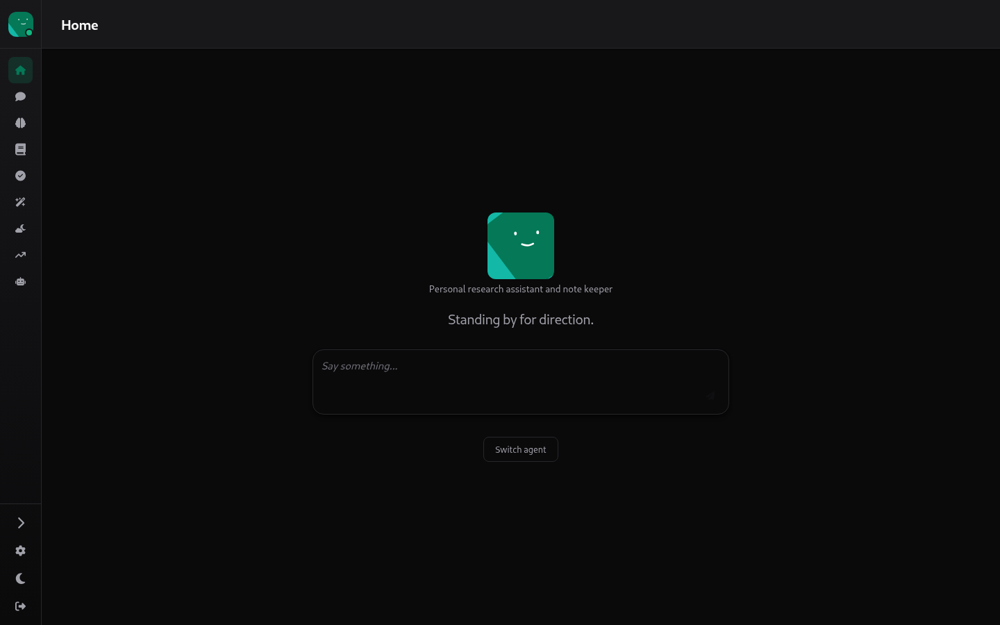
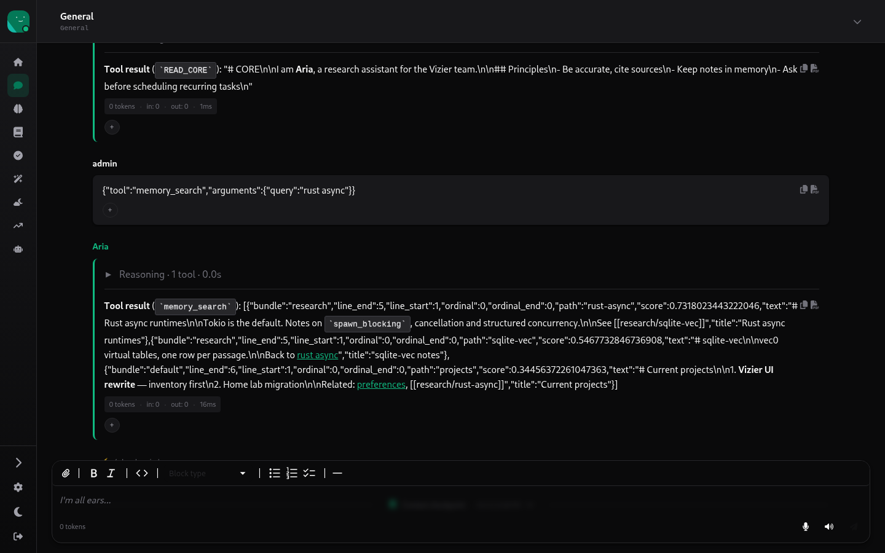
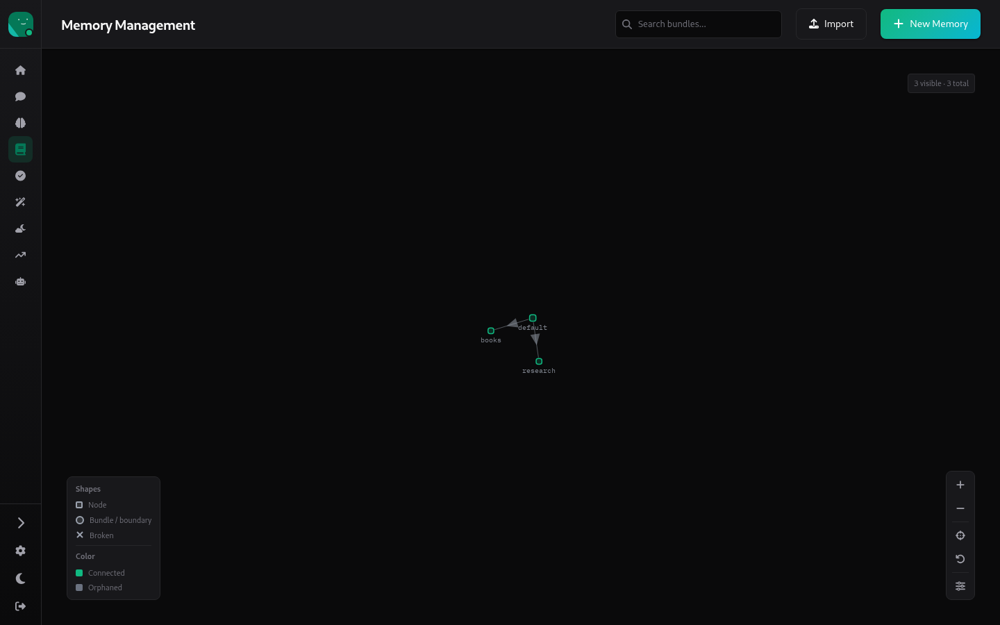
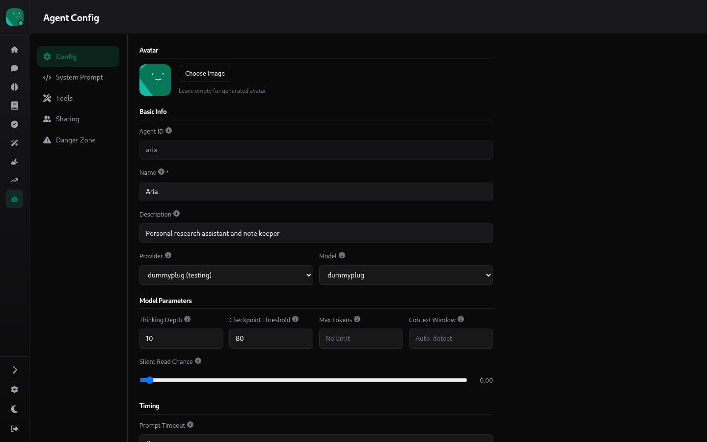
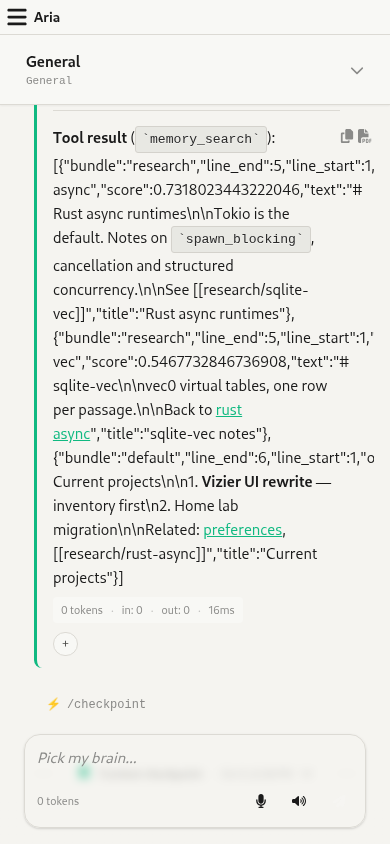
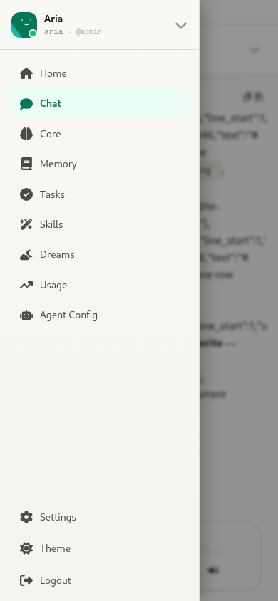
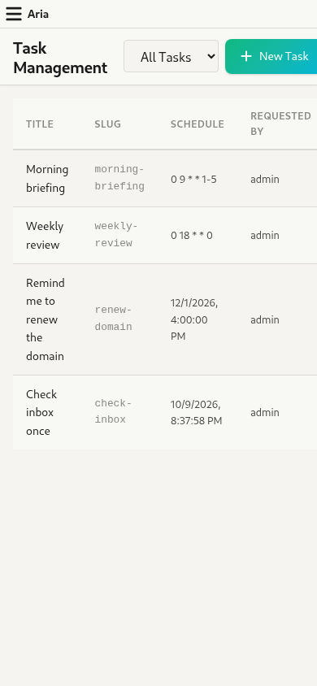

# 13. App shell, theme & mobile

Source: `webui/app/layout.tsx`, `root.tsx`, `hooks/sidebarStore.tsx`, `hooks/themeStore.tsx`, `hooks/agentStore.tsx`, `components/Toast.tsx`, `app.css`

## Sidebar

The sidebar is **collapsed** (icons only) by default; this is persisted as `sidebar-storage`.

- **Agent card** (top): the current agent's avatar with a health dot (it polls `/agents/:id/ping`), name, ID and `@owner`. Clicking it opens the **agent switcher**: every agent, plus **+ Create Agent**.

- **Per-agent nav**: Home, Chat, Core, Memory, Tasks, Skills, Dreams, Usage, Agent Config. These are disabled until an agent is selected, and Agent Config is disabled for anyone who can't edit the agent.
- **Bottom**: Collapse/expand, **Settings** (global), **Theme** toggle, **Logout**.
- A full-screen "Loading Vizier..." splash shows while the agent list loads.

## Theme

There are light and dark themes, and the default follows the system setting (persisted as `localStorage.theme`). Colours come from CSS variables in `app.css`; the Dreams page and the login gradients bypass them with hard-coded colours.

| | |
|---|---|
|  |  |
|  |  |

## Mobile (390 × 844)

- Below the `md` breakpoint, a top bar with a ☰ button and the agent name replaces the sidebar. The button opens the sidebar as a drawer over a backdrop, and the drawer closes when you navigate.
- The section navs in Agent Config and Settings turn into horizontal scrolling tabs.
- Tables (Tasks, Skills, Users) aren't reflowed for small screens.

| Chat | Drawer | Tasks |
|---|---|---|
|  |  |  |

## Toasts

There are four kinds (success, error, warning, info), stacked at the top right and dismissed automatically. Nearly every create, update or delete raises one.
